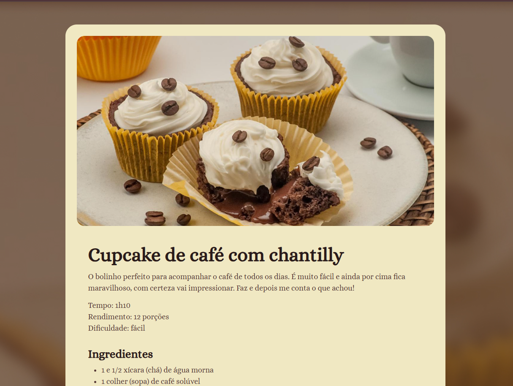

# 🧁 Receita: Cupcake de Café com Chantilly

Este é um projeto de uma página web estática que apresenta uma receita detalhada de cupcakes. O foco principal foi a prática de **HTML5 semântico** e **CSS3**, utilizando fontes personalizadas e um layout centralizado e responsivo.

## 📸 Preview do Projeto

  

---

## 🚀 Tecnologias Utilizadas

* **HTML5**: Estruturação de conteúdo com seções, listas e títulos.
* **CSS3**: 
  * Uso de variáveis CSS (`:root`).
  * Reset de `box-sizing`, margens e paddings.
  * Estilização de fontes externas (Google Fonts).
  * Layout com `margin: auto` para centralização de container.
* **Google Fonts**: Utilização da fonte *Alice* para um visual elegante.

## 📋 Funcionalidades

* **Exibição de imagem**: Imagem principal com bordas arredondadas.
* **Info Card**: Seção de informações rápidas (Tempo, Rendimento e Dificuldade).
* **Lista de Ingredientes**: Organizada com bullets.
* **Modo de Preparo**: Passo a passo detalhado para massa, recheio e montagem.

---

## 🎨 Design

A página utiliza uma paleta de cores quentes e terrosas para remeter ao tema de café:
* **Background:** Imagem de fundo preenchendo a tela.
* **Card Principal:** Fundo na cor `#F0E8C2` com bordas arredondadas.